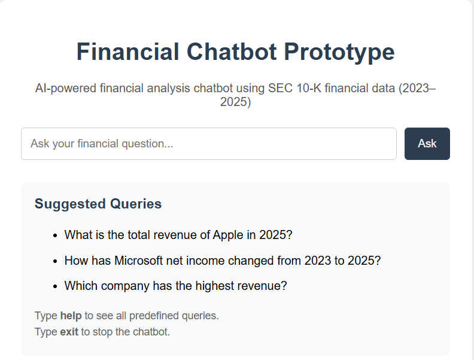

# 📊 Financial Chatbot

AI-powered financial chatbot built using Python, Flask, HTML, and CSS that analyzes SEC 10-K financial data of Microsoft, Apple, and Tesla (2023–2025) and provides financial insights through predefined queries.

---

## 🚀 Features

- Financial chatbot interface  
- Revenue & profit analysis  
- Company comparison  
- Financial trend visualization  
- CSV-based dataset integration  

---

## 🛠️ Tech Stack

- Python  
- Flask  
- Pandas & NumPy  
- Matplotlib  
- HTML & CSS  

---

## ⚙️ Run Project

```bash
git clone https://github.com/pushparajborigarla/financial-chatbot.git
cd financial-chatbot
pip install flask pandas matplotlib numpy
python app.py
```

Open:

```text
http://127.0.0.1:5000
```

---


## ⚠️ Limitations

- Supports predefined queries only  
- No NLP or real-time AI support  

---

## 👨‍💻 Author

**Pushpa Raj**  
B.Tech Computer Science Engineering

---

## 🔗 Repository

https://github.com/pushparajborigarla/financial-chatbot



